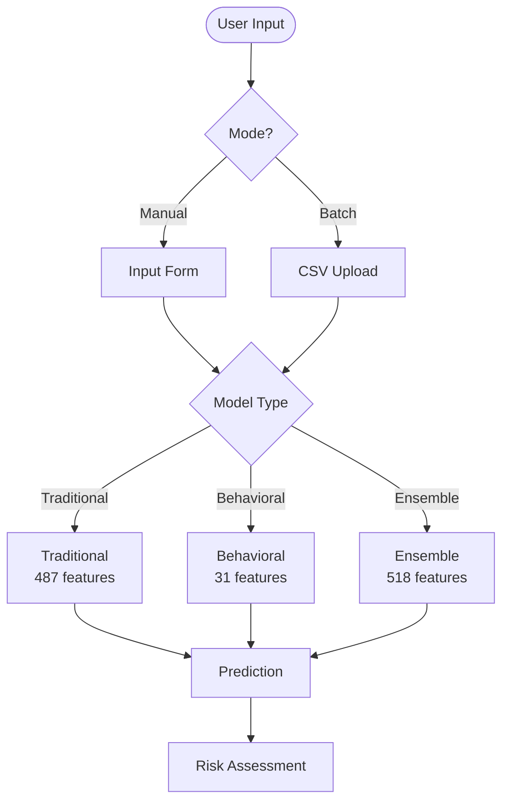
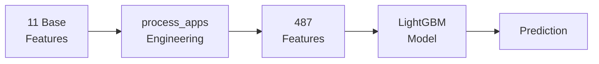
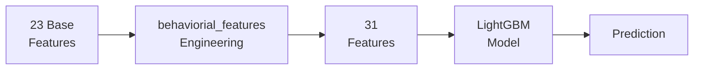
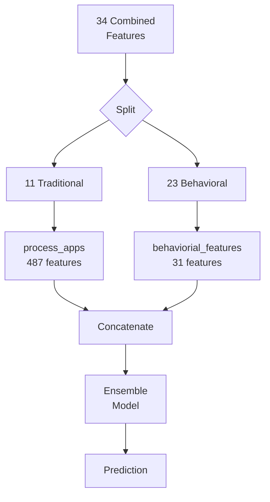
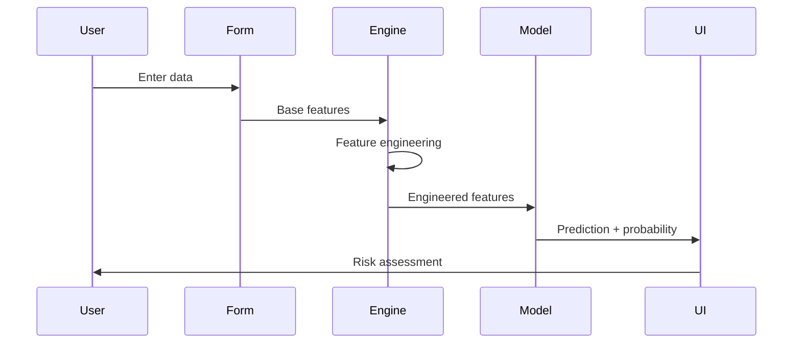
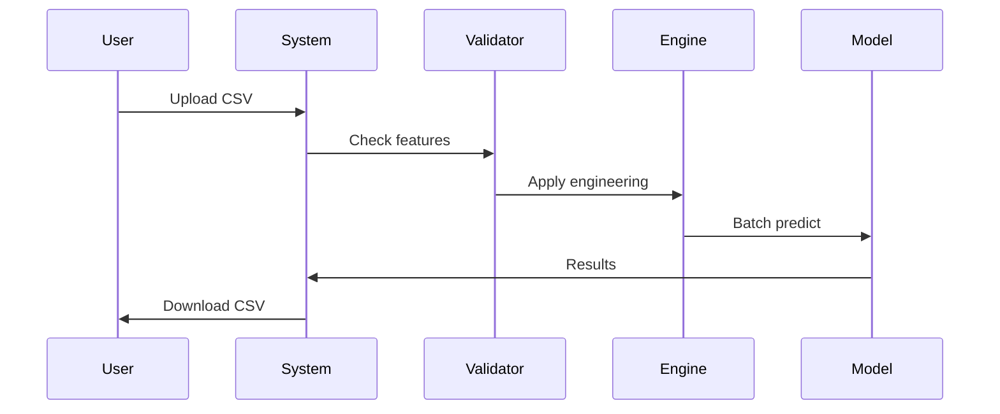
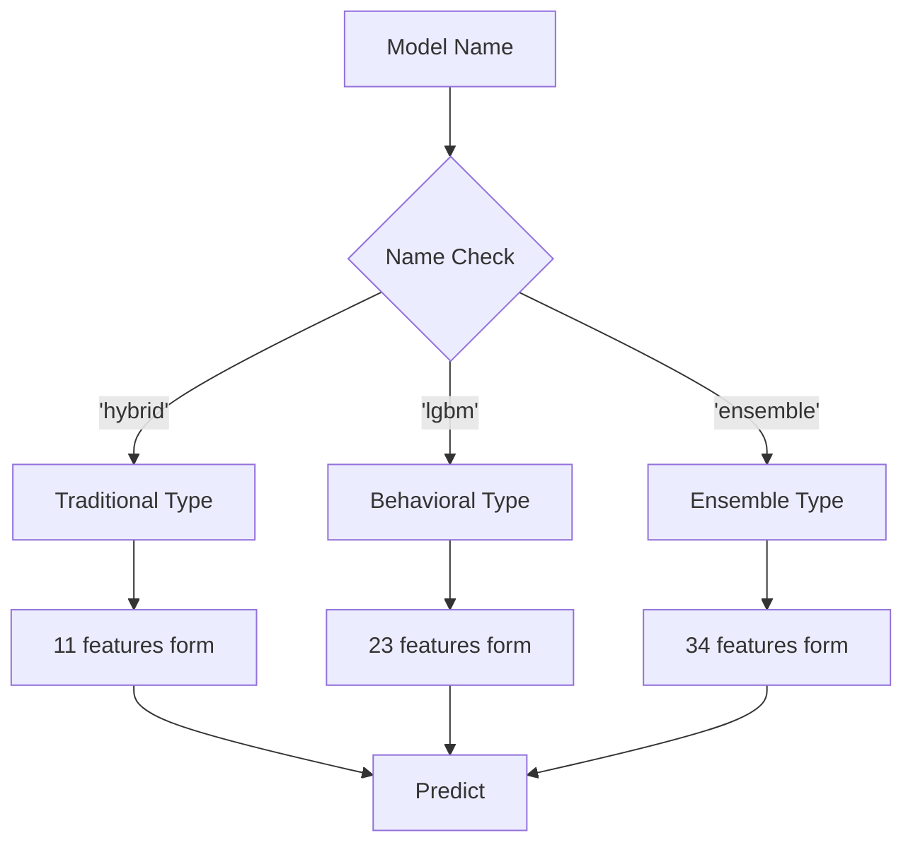
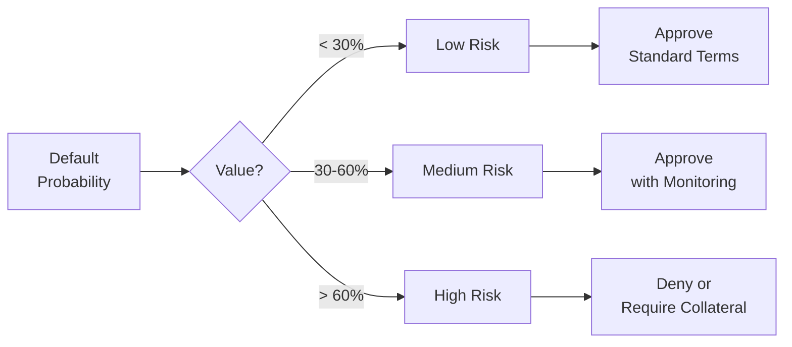
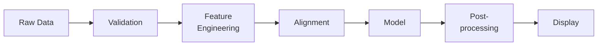
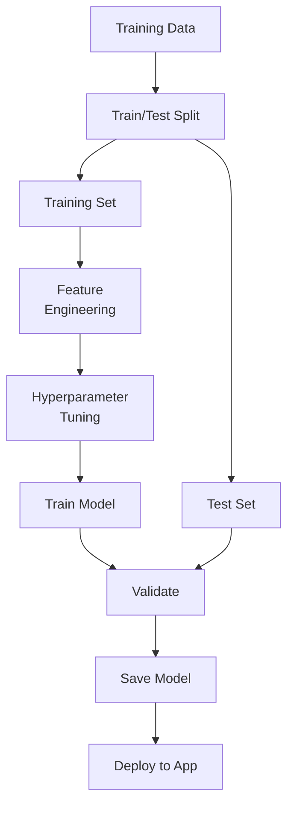

# Loan Default Hybrid System - Architecture Guide

## System Overview



---

## Model Pipelines

### 1. Traditional Model (Home Credit)

**Input:** 11 base features → **Process:** Feature engineering → **Output:** 487 features



**Base Features:**

- Credit scores (EXT_SOURCE_1, EXT_SOURCE_2, EXT_SOURCE_3)
- Loan amounts (AMT_CREDIT, AMT_INCOME_TOTAL, AMT_ANNUITY, AMT_GOODS_PRICE)
- Demographics (DAYS_BIRTH, DAYS_EMPLOYED, CNT_FAM_MEMBERS, OWN_CAR_AGE)

**Engineered Features:** Ratios, aggregations, temporal features, statistical metrics

---

### 2. Behavioral Model (UCI Credit Card)

**Input:** 23 base features → **Process:** Feature engineering → **Output:** 31 features



**Base Features:**

- Demographics: LIMIT_BAL, SEX, EDUCATION, MARRIAGE, AGE
- Payment history: PAY_0, PAY_2, PAY_3, PAY_4, PAY_5, PAY_6
- Bill amounts: BILL_AMT1-6
- Payment amounts: PAY_AMT1-6

**Engineered Features:** Total amounts, volatility metrics, payment behavior, risk indicators, trends

---

### 3. Ensemble Model (Hybrid)

**Input:** 34 features (11 traditional + 23 behavioral) → **Process:** Both pipelines → **Output:** 518 features



---

## Feature Engineering

### Traditional Engineering (process_apps)

Creates 487 features from 11 base inputs:

1. **Ratio Features:** Credit/Income, Annuity/Credit, Goods/Income
2. **Aggregations:** Mean/Std of external sources
3. **Temporal:** Age calculations, employment duration
4. **Statistical:** Min/Max/Mean across categories
5. **Interactions:** Cross-feature products, conditional values

### Behavioral Engineering (behaviorial_features)

Creates 31 features from 23 base inputs:

1. **Aggregates:** Total billed, total payments, average transaction
2. **Volatility:** Spending volatility, income consistency, rolling balance changes
3. **Payment Behavior:** Consistency ratio, repayment ratio, missed payments
4. **Risk Indicators:** Debt stress index, credit utilization, spend-to-income
5. **Trends:** Bill changes over time, credit utilization trend

---

## Data Flow

### Manual Input Flow



### Batch Input Flow



---

## Model Selection Logic



---

## Risk Classification



**Risk Levels:**

- **Low Risk (<30%):** Strong credit indicators, approve with standard terms
- **Medium Risk (30-60%):** Mixed indicators, approve with careful monitoring
- **High Risk (>60%):** Weak indicators, deny or require additional collateral

---

## System Architecture

### Application Structure

```
Loan Default Hybrid System/
├── app.py                          # Streamlit main app
├── pages/
│   ├── Prediction.py               # Prediction interface
│   ├── EDA.py                      # Exploratory analysis
│   ├── Feature_Importance.py       # Feature insights
│   └── Model_Metrics.py            # Performance metrics
├── apps/
│   └── utils.py                    # Helper functions
├── src/
│   └── feature_engineering.py      # Feature transformations
├── models/
│   ├── model_hybrid.pkl            # Traditional (487)
│   ├── first_lgbm_model.pkl        # Behavioral (31)
│   └── model_ensemble_wrapper.pkl  # Ensemble (518)
└── data/
    └── [training datasets]
```

---

## Component Architecture

### Core Components

1. **Streamlit UI:** Multi-page application for user interaction
2. **Feature Engineering:** Transforms raw features into model-ready data
3. **Model Manager:** Loads and caches trained models
4. **Prediction Engine:** Handles single and batch predictions
5. **Visualization:** Risk gauges, probability displays, result tables

### Data Processing Pipeline



---

## Technology Stack

**Languages & Frameworks:**

- Python 3.13
- Streamlit (UI framework)
- LightGBM (ML models)
- Pandas/NumPy (data processing)

**Key Libraries:**

- scikit-learn: Model utilities
- plotly: Interactive visualizations
- pickle: Model serialization

**Development:**

- Virtual environment: myenv/
- Package management: pip
- Version control: Git

---

## Deployment

### Local Setup

1. Clone repository
2. Create virtual environment: `python -m venv myenv`
3. Activate: `myenv\Scripts\activate`
4. Install: `pip install -r requirements.txt`
5. Run: `streamlit run app.py`

### Access

- Local: http://localhost:8501
- Network: http://[IP]:8501

---

## Security & Performance

### Security Considerations

- Input validation on all user data
- CSV file size limits
- Model file integrity checks
- Error handling for malformed inputs

### Performance Optimizations

- Model caching with @st.cache_resource
- Batch prediction optimization
- Feature alignment caching
- Efficient DataFrame operations

### Error Handling

- Graceful degradation for missing features
- User-friendly error messages
- Fallback values for edge cases
- Logging for debugging

---

## Model Training Architecture

### Training Pipeline



### Model Versions

- **Traditional Model:** Trained on Home Credit default risk dataset
- **Behavioral Model:** Trained on UCI credit card default dataset
- **Ensemble Model:** Trained on combined hybrid features

---

## Key Metrics

### Model Performance Indicators

- **Accuracy:** Overall prediction correctness
- **Precision:** True positives / (True positives + False positives)
- **Recall:** True positives / (True positives + False negatives)
- **F1-Score:** Harmonic mean of precision and recall
- **AUC-ROC:** Area under receiver operating characteristic curve

### Feature Importance

Available in Feature_Importance.py page:

- SHAP values for individual predictions
- Feature contribution analysis
- Top influential features visualization

---

## Usage Guidelines

### Manual Input Best Practices

- Use accurate, up-to-date information
- Complete all required fields
- Understand feature definitions
- Consider model limitations

### Batch Prediction Best Practices

- Prepare CSV with correct column names
- Ensure data quality and consistency
- Use appropriate model for dataset type
- Validate results before decisions

### Model Selection Guidelines

- **Traditional:** For Home Credit-style applicants
- **Behavioral:** For credit card payment history analysis
- **Ensemble:** For comprehensive risk assessment with both data types

---

## Troubleshooting

### Common Issues

**Issue:** Prediction fails with feature mismatch

- **Solution:** Ensure CSV has all required features for selected model

**Issue:** Low accuracy on manual input (traditional model)

- **Solution:** Use batch prediction with full dataset; manual form has limited features

**Issue:** Model loading errors

- **Solution:** Check model files exist in models/ directory

**Issue:** Feature engineering errors

- **Solution:** Verify input data types and value ranges

---

## Future Enhancements

### Planned Features

1. **Model Retraining:** Automated retraining with new data
2. **API Integration:** REST API for external systems
3. **Real-time Monitoring:** Live prediction metrics dashboard
4. **A/B Testing:** Compare model versions
5. **Explainability:** Enhanced SHAP visualizations
6. **Mobile Support:** Responsive design improvements

### Model Improvements

- Regular model updates with fresh data
- Ensemble technique optimization
- Feature engineering refinement
- Performance benchmarking

---

## Contact & Support

For questions, issues, or contributions:

- Review documentation in project README
- Check MODEL_ARCHITECTURE_FLOWCHART.md for architecture details
- Examine code comments for implementation details
- Test with provided sample datasets

---

**Document Version:** 2.0  
**Last Updated:** November 2025  
**Maintained by:** Loan Default Hybrid System Team
