### Loan Default Hybrid System - Model Architecture Flowchart

#### System Overview


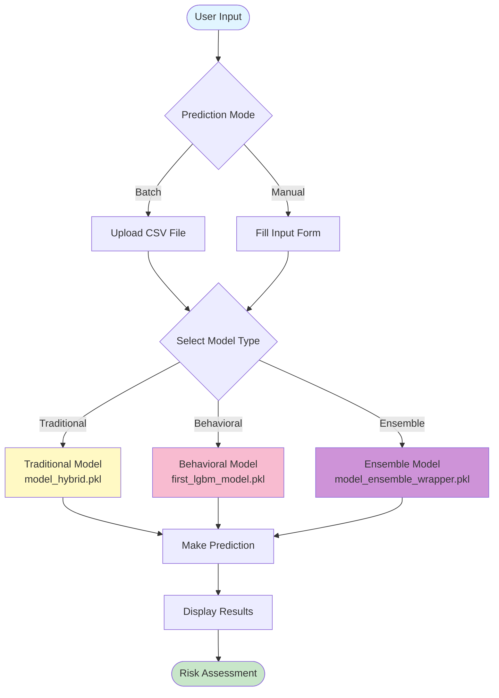

---

### Detailed Model Pipeline

**1. Traditional Model Pipeline (Home Credit Features)**

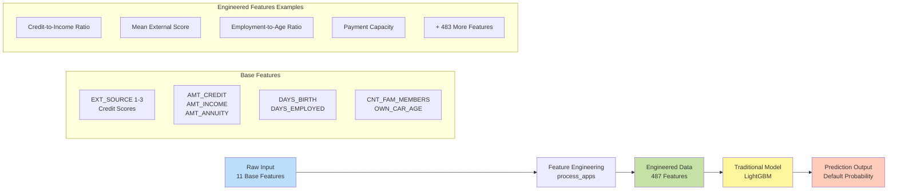

**Traditional Model Flow:**

1. **Input**: 11 base features from Home Credit dataset
2. **Processing**: `process_apps()` function creates 487 engineered features
3. **Model**: LightGBM trained on 487 features
4. **Output**: Default probability (0-1)

---

**2. Behavioral Model Pipeline (UCI Credit Card Features)**

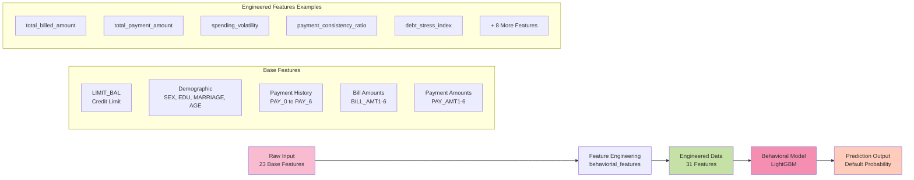

**Behavioral Model Flow:**

1. **Input**: 23 base features from UCI Credit Card dataset
2. **Processing**: `behaviorial_features()` function creates 31 total features (23 base + 8 engineered)
3. **Model**: LightGBM trained on 31 features
4. **Output**: Default probability (0-1)

---

**3. Ensemble Model Pipeline (Hybrid Features)**

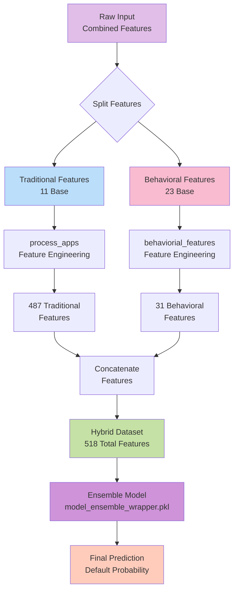

**Ensemble Model Flow:**

1. **Input**: Combined 34 base features (11 traditional + 23 behavioral)
2. **Split**: Separate features into traditional and behavioral groups
3. **Processing**:
   - Apply `process_apps()` to traditional features → 487 features
   - Apply `behaviorial_features()` to behavioral features → 31 features
4. **Combine**: Concatenate both feature sets → 518 total features
5. **Model**: Ensemble LightGBM trained on hybrid features
6. **Output**: Default probability (0-1)

---

## Feature Engineering Details

### Traditional Feature Engineering (`process_apps`)

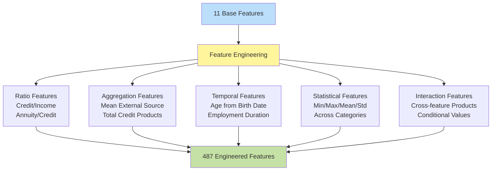

#### Behavioral Feature Engineering (`behaviorial_features`)

```mermaid
graph TD
    Input[23 Base Features] --> FE[Feature Engineering]

    FE --> Cat1[Financial Aggregates<br/>Total Billed Amount<br/>Total Payment Amount<br/>Avg Transaction]
    FE --> Cat2[Volatility Metrics<br/>Spending Volatility<br/>Rolling Balance<br/>Income Consistency]
    FE --> Cat3[Payment Behavior<br/>Payment Consistency<br/>Repayment Ratio<br/>Missed Payment Count]
    FE --> Cat4[Risk Indicators<br/>Debt Stress Index<br/>Credit Utilization<br/>Spend-to-Income Ratio]
    FE --> Cat5[Trend Features<br/>Bill Changes (1-2, 3-4, 4-5)<br/>Credit Utilization Trend]

    Cat1 --> Output[31 Total Features<br/>23 Base + 8 Engineered]
    Cat2 --> Output
    Cat3 --> Output
    Cat4 --> Output
    Cat5 --> Output

    style Input fill:#f8bbd0
    style FE fill:#f48fb1
    style Output fill:#c5e1a5
```

---

### Data Flow Architecture

#### Manual Input (Single Applicant)

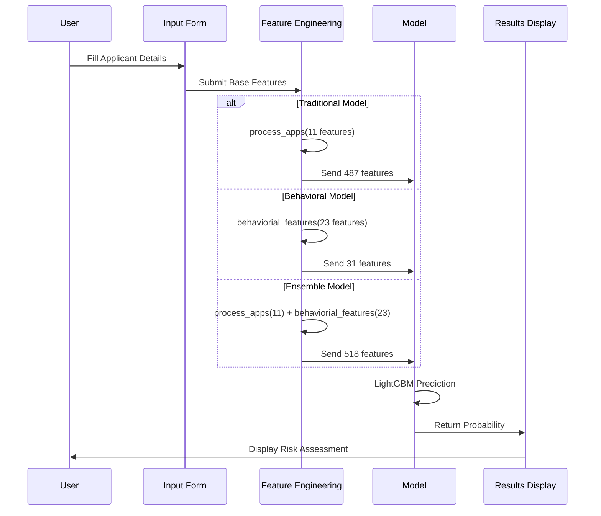

#### Batch Input (CSV Upload)

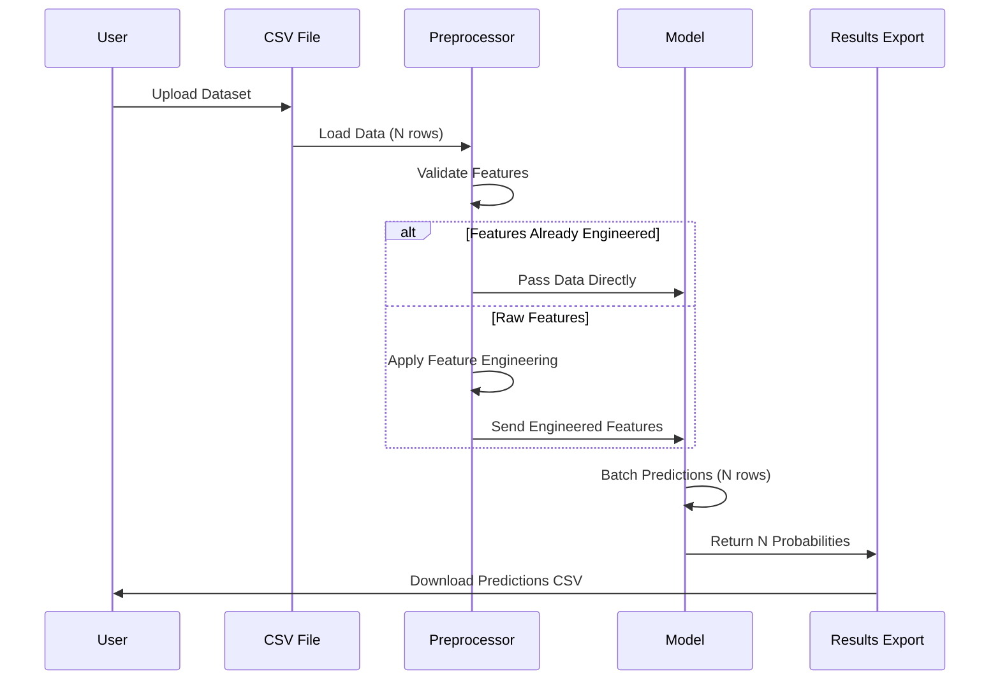

---

### Model Selection Logic

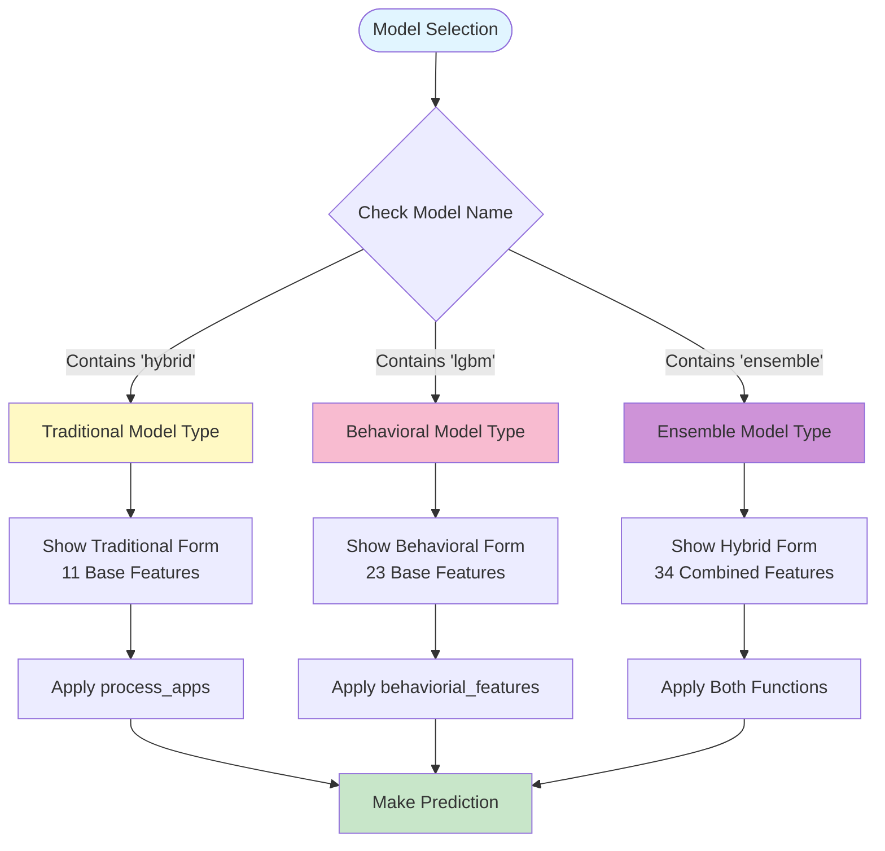

---

### Risk Classification Pipeline

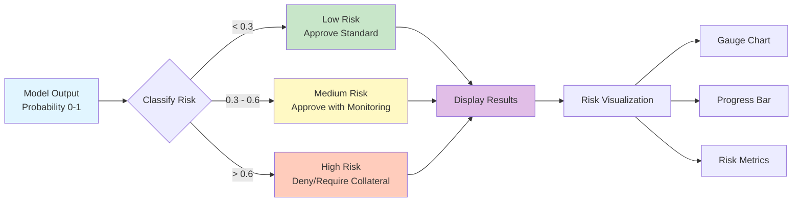

---

### Feature Count Summary

| Model Type      | Base Features | Engineered Features | Total Features |
| --------------- | ------------- | ------------------- | -------------- |
| **Traditional** | 11            | 476                 | **487**        |
| **Behavioral**  | 23            | 8                   | **31**         |
| **Ensemble**    | 34 (11+23)    | 484 (476+8)         | **518**        |

---

### Key Engineering Functions

#### Traditional: `process_apps(df)`

```python
Input:  11 base features
        ├── EXT_SOURCE_1, EXT_SOURCE_2, EXT_SOURCE_3
        ├── AMT_CREDIT, AMT_INCOME_TOTAL, AMT_ANNUITY, AMT_GOODS_PRICE
        ├── DAYS_BIRTH, DAYS_EMPLOYED
        └── CNT_FAM_MEMBERS, OWN_CAR_AGE

Output: 487 engineered features
        ├── Original 11 features
        ├── 476 calculated features:
            ├── Ratios (credit/income, annuity/income, etc.)
            ├── Aggregations (mean, sum, max, min)
            ├── Statistical (std, variance, percentiles)
            └── Interactions (cross-products, conditionals)
```

#### Behavioral: `behaviorial_features(df)`

```python
Input:  23 base features
        ├── LIMIT_BAL, SEX, EDUCATION, MARRIAGE, AGE
        ├── PAY_0, PAY_2, PAY_3, PAY_4, PAY_5, PAY_6
        ├── BILL_AMT1-6 (6 features)
        └── PAY_AMT1-6 (6 features)

Output: 31 features (23 base + 8 engineered)
        ├── Original 23 features
        ├── 8 calculated features:
            ├── total_billed_amount
            ├── total_payment_amount
            ├── avg_transaction_amount
            ├── spending_volatility
            ├── payment_consistency_ratio
            ├── debt_stress_index
            ├── credit_utilization_trend
            └── missed_payment_count (+ others)
```

---

#### Model Training Architecture

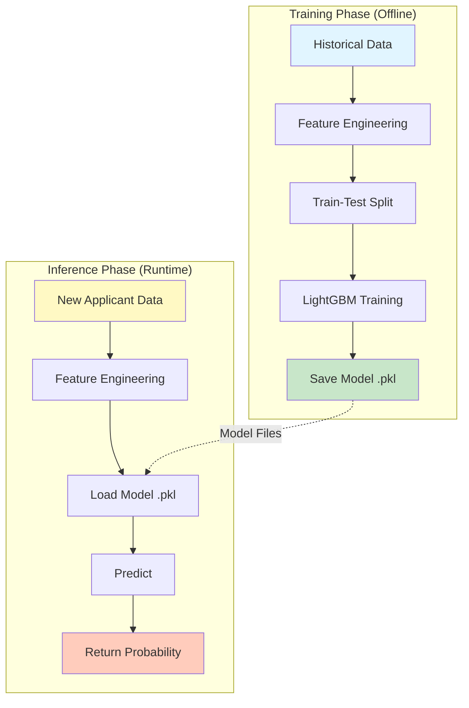

---

#### System Architecture Overview

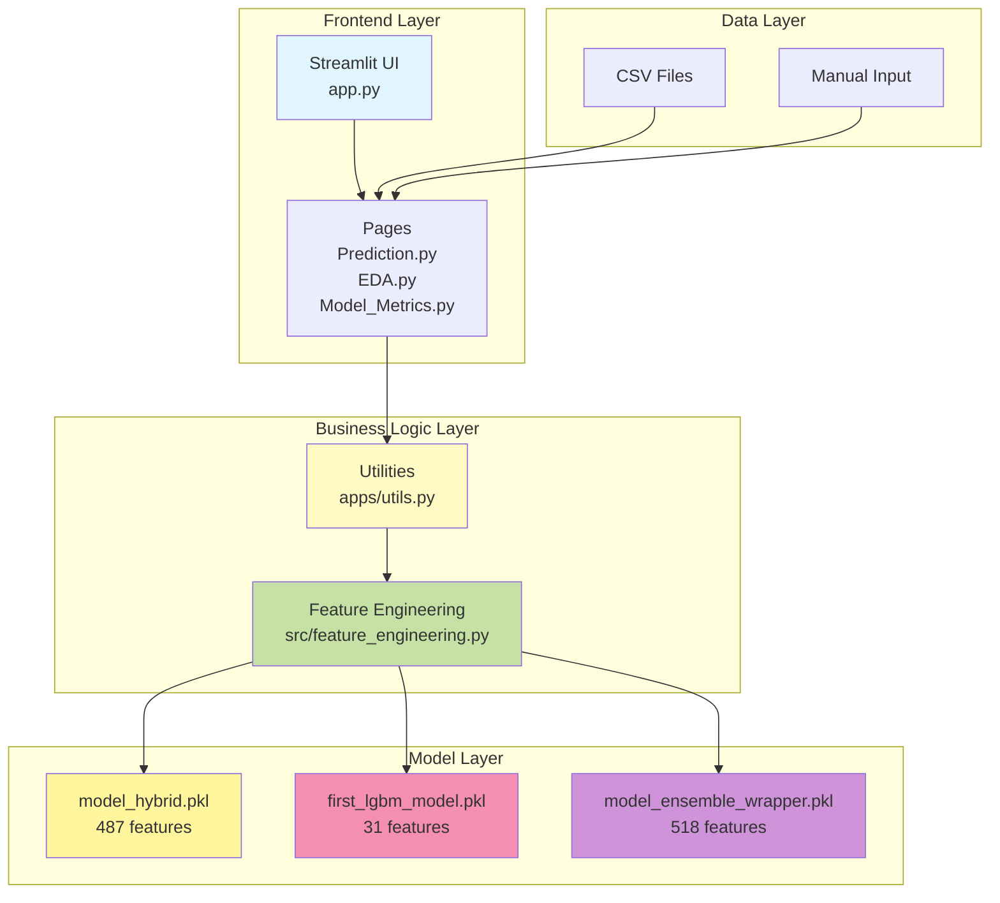

---

---

#### Complete System Architecture

##### Full Application Structure

```mermaid
graph TB
    subgraph "Presentation Layer (Streamlit)"
        App[app.py<br/>Main Entry Point]
        Home[Home.py<br/>Landing Page]
        Pred[Prediction.py<br/>Risk Assessment]
        EDA[EDA.py<br/>Data Analysis]
        FI[Feature_Importance.py<br/>Model Insights]
        MM[Model_Metrics.py<br/>Performance]
    end

    subgraph "Business Logic Layer"
        Utils[apps/utils.py<br/>Model Loading<br/>Predictions<br/>Visualizations]
        FE[src/feature_engineering.py<br/>process_apps()<br/>behaviorial_features()]
    end

    subgraph "Model Layer"
        M1[models/model_hybrid.pkl<br/>Traditional LightGBM]
        M2[models/first_lgbm_model.pkl<br/>Behavioral LightGBM]
        M3[models/model_ensemble_wrapper.pkl<br/>Ensemble Model]
    end

    subgraph "Data Layer"
        TrainData[Training Data<br/>smoke_engineered.csv<br/>uci_interface_test.csv]
        TestData[Test Data<br/>smoke_hybrid_features.csv]
        UserData[User Uploads<br/>CSV Files]
    end

    subgraph "Configuration"
        Env[Environment<br/>myenv/<br/>Python 3.13]
        Req[Dependencies<br/>requirements.txt]
    end

    App --> Home
    App --> Pred
    App --> EDA
    App --> FI
    App --> MM

    Pred --> Utils
    EDA --> Utils
    FI --> Utils
    MM --> Utils

    Utils --> FE
    Utils --> M1
    Utils --> M2
    Utils --> M3

    FE --> TrainData
    M1 --> TrainData
    M2 --> TrainData
    M3 --> TrainData

    UserData --> Pred
    TestData --> Pred

    Env --> App
    Req --> Env

    style App fill:#4fc3f7
    style Utils fill:#fff59d
    style FE fill:#aed581
    style M1 fill:#ffb74d
    style M2 fill:#f06292
    style M3 fill:#ba68c8
```

---

#### Detailed Component Architecture

##### 1. Frontend Components (Streamlit Pages)

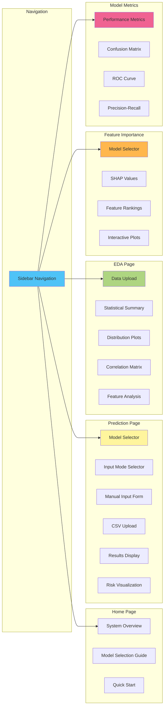

---

##### 2. Business Logic Components

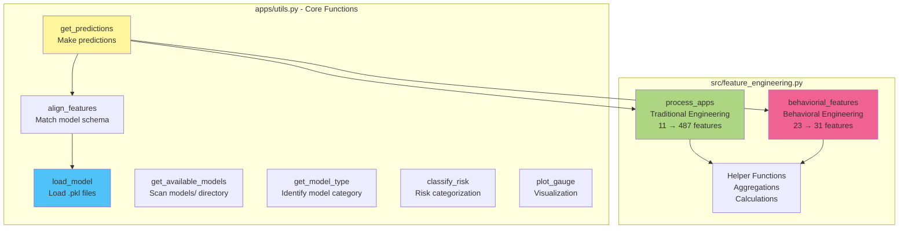

---

##### 3. File Structure Tree

```
Loan Default Hybrid System/
│
├── app.py                          # Main Streamlit application
├── requirement.txt                 # Python dependencies
├── MODEL_ARCHITECTURE_FLOWCHART.md # This documentation
├── DATA_FLOW_EXPLANATION.md        # Data flow docs
│
├── myenv/                          # Virtual environment
│   ├── Scripts/                       # Python executables
│   └── Lib/                           # Installed packages
│
├── pages/                          # Streamlit pages
│   ├── Prediction.py                  # Main prediction interface
│   ├── EDA.py                         # Exploratory data analysis
│   ├── Feature_Importance.py          # Feature importance plots
│   └── Model_Metrics.py               # Model performance metrics
│
├── apps/                           # Business logic
│   └── utils.py                       # Core utility functions
│
├── src/                            # Source code
│   └── feature_engineering.py         # Feature engineering functions
│
├── models/                         # Trained models
│   ├── model_hybrid.pkl               # Traditional model (487 features)
│   ├── first_lgbm_model.pkl           # Behavioral model (31 features)
│   └── model_ensemble_wrapper.pkl     # Ensemble model (518 features)
│
└── data/ (optional)                # Training/test data
    ├── smoke_engineered.csv           # Traditional features
    ├── uci_interface_test.csv         # Behavioral features
    └── smoke_hybrid_features.csv      # Hybrid features
```

---

##### 4. Technology Stack

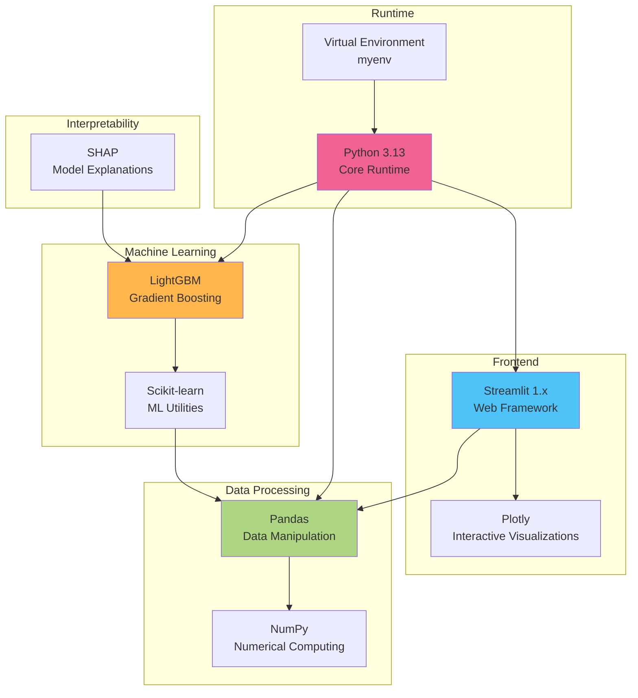

**Key Dependencies:**

- **Streamlit**: Web application framework
- **LightGBM**: Gradient boosting model
- **Pandas**: Data manipulation
- **NumPy**: Numerical operations
- **Plotly**: Interactive visualizations
- **SHAP**: Model interpretability
- **Scikit-learn**: ML utilities

---

##### 5. Request-Response Flow

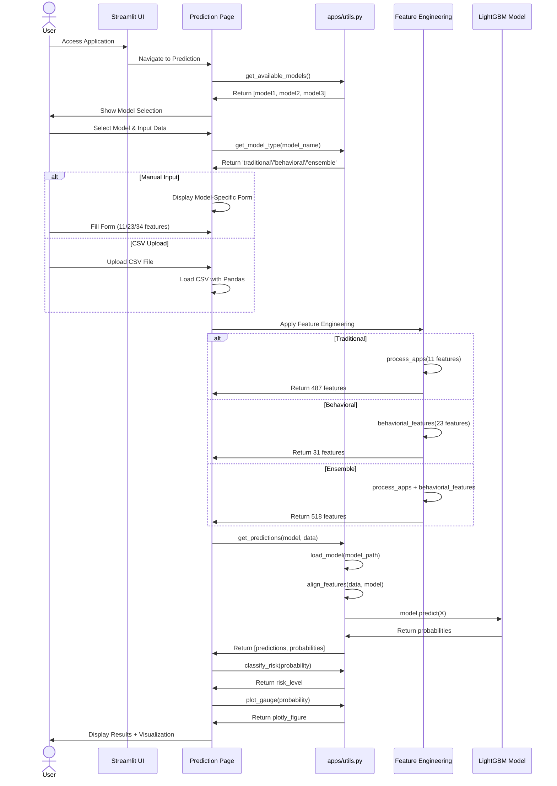

---

##### 6. Data Flow Through System

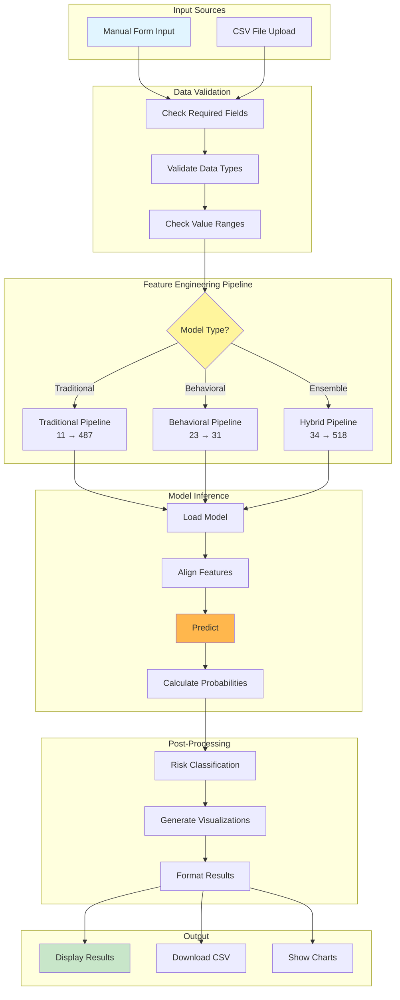

---

##### 7. Model Loading & Caching Strategy

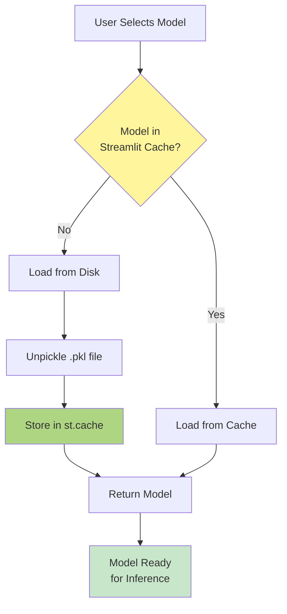

**Caching Benefits:**

- Models loaded once per session
- Faster subsequent predictions
- Reduced memory overhead
- Better user experience

---

##### 8. Error Handling & Validation

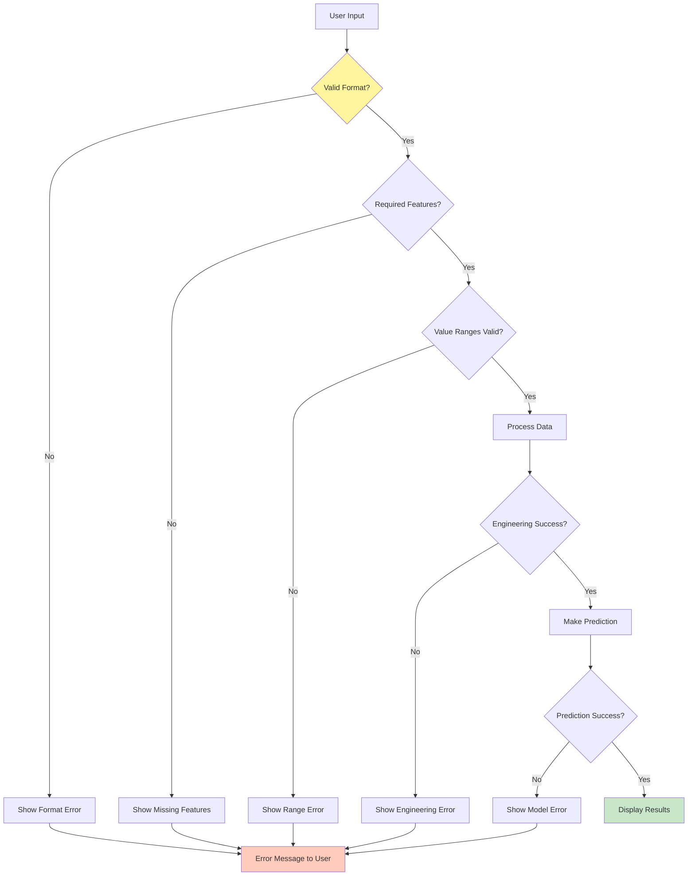

---

#### 9. Deployment Architecture (Production Ready)

```mermaid
graph TB
    subgraph "Client Layer"
        Browser[Web Browser]
    end

    subgraph "Web Server"
        Streamlit[Streamlit Server<br/>Port 8501]
    end

    subgraph "Application Layer"
        App[Python Application<br/>app.py]
        Pages[Page Modules]
        Utils[Utility Functions]
    end

    subgraph "ML Layer"
        Models[Serialized Models<br/>.pkl files]
        FE[Feature Engineering<br/>Functions]
    end

    subgraph "Data Storage"
        Local[Local CSV Files]
        Upload[User Uploads<br/>Temp Storage]
    end

    Browser -->|HTTP| Streamlit
    Streamlit -->|WSGI| App
    App --> Pages
    Pages --> Utils
    Utils --> Models
    Utils --> FE
    FE --> Local
    Pages --> Upload

    style Browser fill:#e1f5ff
    style Streamlit fill:#4fc3f7
    style Models fill:#ffb74d
    style Local fill:#aed581
```

**Deployment Options:**

- **Local**: `streamlit run app.py`
- **Cloud**: Streamlit Community Cloud, Heroku, AWS, Azure
- **Docker**: Containerized deployment
- **Requirements**: Python 3.13, ~500MB models, 2GB RAM minimum

---

#### 10. Security & Performance Considerations

```mermaid
graph LR
    subgraph "Security"
        S1[Input Validation]
        S2[File Type Checking]
        S3[Size Limits]
        S4[No Data Persistence]
    end

    subgraph "Performance"
        P1[Model Caching]
        P2[Lazy Loading]
        P3[Batch Processing]
        P4[Memory Management]
    end

    subgraph "Reliability"
        R1[Error Handling]
        R2[Fallback Values]
        R3[Logging]
        R4[User Feedback]
    end

    style S1 fill:#ffccbc
    style P1 fill:#aed581
    style R1 fill:#fff59d
```

---

### Summary

This hybrid system provides three specialized models:

1. **Traditional Model**: Deep feature engineering from 11 base features → 487 features
2. **Behavioral Model**: Payment pattern analysis from 23 base features → 31 features
3. **Ensemble Model**: Combined approach using both feature sets → 518 features

Each model uses LightGBM for predictions and returns a probability (0-1) representing default risk, which is then classified into Low/Medium/High risk categories for actionable insights.

#### System Highlights:

- **Modular Architecture**: Clean separation of concerns (UI, Logic, Models, Data)
- **Scalable Design**: Easy to add new models or features
- **User-Friendly**: Streamlit provides intuitive interface
- **Production-Ready**: Error handling, caching, validation
- **Well-Documented**: Comprehensive flowcharts and architecture diagrams
